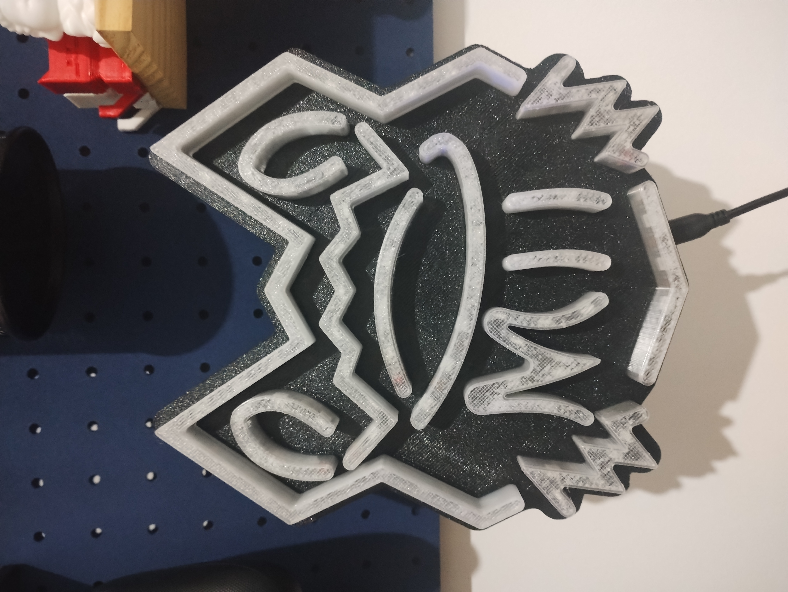
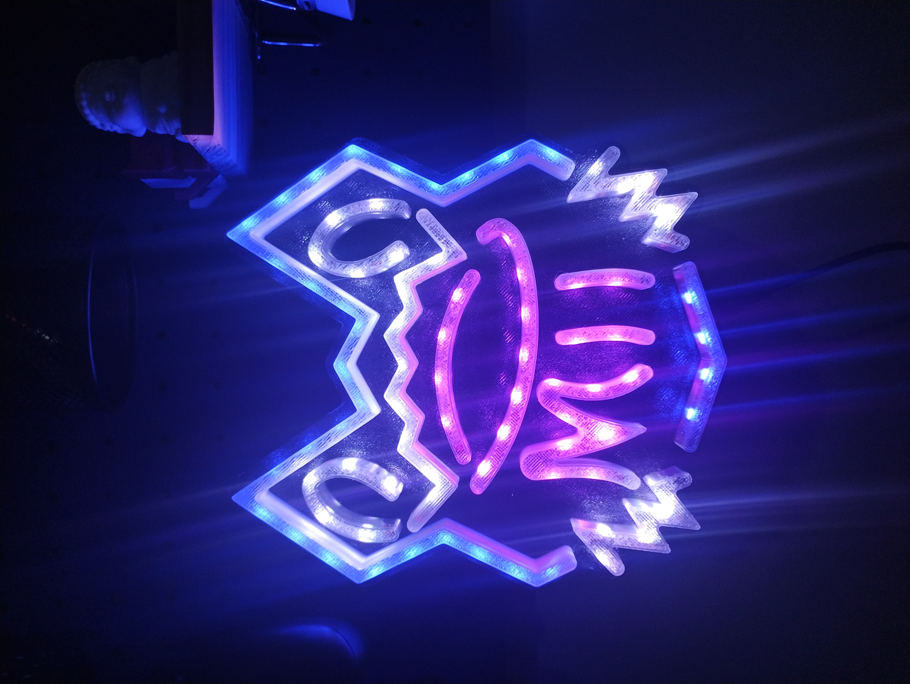

# Mii Neon

Projeto de uma luminaria de led baseado em esp32, controlado remotamente via navegador.
Inspirado no neon presente no cenario das lives da [Mii Reis](https://www.youtube.com/@Mii_Reis).





## Funcionalidades

- Controle de cores, brilho e efeitos via interface web responsiva.
- Atualizações remotas para firmware.
- Endereço web personalizado via mDNS

## Tecnologias e Bibliotecas

- Firmware (C++, PlatformIO, Arduino):
  - FastLED para controle de LEDs
  - ESPAsyncWebServer e ESPAsyncTCP para servidor assíncrono web
  - ArduinoJson para manipulação de dados

- Frontend:
  - HTML, CSS, JavaScript
  - Bootstrap 5.3.8 (armazenado localmente na flash do ESP32)

## Como rodar

1. Pré-requisitos

- PlatformIO instalado
- Node.js e live-server para simular o frontend localmente (opcional, para desenvolvimento do front localmente)

1. Clone o repositório

```sh
git clone https://github.com/HugoOliveiraSoares/Mii_neon
cd Mii_neon
```

1. Definir env em [platformio.ini](platformio.ini), opções dev ou prd

```ini
[platformio]
default_envs =
  prd
```

1. Conecte o ESP32 via USB e compile e envie o firmware e filesystem

```sh
make upload    # Compila o firmware e envia para o microcontrolador
make uploadfs  # Faz o build do filesystem e envia para o microcontrolador
```

1. Abra o monitor serial (opcional para debug)

```sh
make monitor
```

1. Acesse o painel
   Entre o endereço `http://mii-neon.local` ou IP mostrado no monitor serial.

Também é possivel:
Executar o front localmente

```sh
make liveserver
```

Criar pacote de atualização do filesystem

```sh
make create_tar
```

**Obs**

Se modificar arquivos em data/, rode make uploadfs novamente ou crie a um pacote de atualização.
Para atualização do frontend, use make create_tar e envie o arquivo pelo painel web em `Configurações > Atualizações > Atualize o filesystem`.
